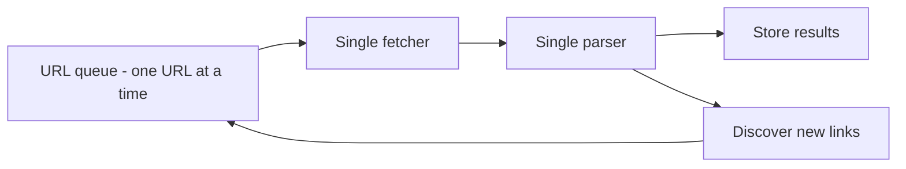
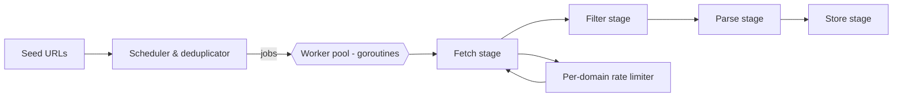

# WHY this Project Exists

This document explains **why** the Concurrent Web Crawler with Pluggable Pipelines exists, what problems it solves, and how you can think about it from both a **beginner** and an **advanced** point of view.

We will cover:

1. Problems faced *before* developing this project
2. Why this project is the right choice
3. The need for this project
4. Applications (layman style and professional style)
5. Uses of the project
6. Concrete real‑life examples
7. How developers can plug this crawler into their own stacks

Along the way, you will see simple diagrams and real‑world comparisons.

---

## 1. Problems Faced Before Developing the Project

### 1.1 Beginner View – What goes wrong with a simple crawler?

Imagine you write a very basic crawler:

- You keep a **list of URLs**.
- You **fetch one URL at a time**.
- You read the HTML, maybe print the title, and then move to the next URL.

This works for a toy example, but you quickly hit problems:

1. **Too slow**
   - Only one page is fetched at a time.
   - If a website is slow, your entire crawler just waits.

2. **No clear pipeline**
   - Fetching, parsing, filtering, and storing are all mixed into one big function.
   - It is hard to understand and hard to change individual steps.

3. **Hard to extend**
   - If you want to add a new step (e.g., store in a database, send to Kafka, run NLP), you have to rewrite the core code.

4. **No protection for target websites**
   - If you suddenly make it concurrent (many goroutines) without thinking, you might **hammer a site** with too many requests.
   - This can look like a small DoS attack from the site’s point of view.

5. **No backpressure or control**
   - When you use many goroutines without a good design, they can generate **more work than your system or the target sites can handle**.
   - Nothing stops the crawler from flooding the queue with URLs.

#### Simple "before" diagram (slow, single-threaded crawler)

- Only **one** fetcher and one parser.
- Everything is in a **single pipeline**, and the queue can grow without smart control.

---

### 1.2 Advanced View – Concurrency, backpressure, rate limiting

From a more advanced Go / systems perspective, the problems are:

1. **Lack of structured concurrency**
   - No clear separation of concerns for:
     - Scheduling
     - Fetching
     - Parsing
     - Storing
   - Hard to reason about **liveness** (will it keep working?) and **safety** (will it corrupt or lose data?).

2. **No backpressure**
   - Producers (e.g., link discovery) can generate URLs much faster than consumers (fetchers, parsers) can process them.
   - This leads to **unbounded growth** of in-memory queues, high memory usage, and possibly your process being killed.

3. **Missing per-domain rate limiting**
   - Without limiting, you can perform many parallel HTTP requests to the same domain.
   - This is bad etiquette and can violate real-world crawling rules like robots.txt intentions or polite crawling norms.

4. **Tight coupling**
   - The logic of how to crawl (scheduling, depth, duplicates) is tightly coupled with what to do with each page (parse, store, analyze).
   - You cannot easily plug in a new pipeline (e.g., “send to Elasticsearch” vs “save to local JSON”).

5. **Difficult to test and evolve**
   - Monolithic design means small changes risk breaking the entire crawler.
   - No modular boundaries to test individual parts (scheduler, fetch stage, parser, etc.).

---

## 2. Why This Project is the Right Choice

### 2.1 Beginner View – Intuition

This project is designed as a **clean, teachable example** of how to build a modern web crawler in Go with:

- **Concurrency**: use many workers (goroutines) to crawl faster, but safely.
- **Pipelines**: break work into steps (discover → fetch → filter → parse → store).
- **Pluggable design**: you can swap or extend stages without rewriting everything.

You can think of it like a **factory**:

- Raw material (URLs) comes in.
- It passes through different **stations** (discover, fetch, filter, parse, store).
- Each station can be upgraded or replaced without rebuilding the entire factory.

### 2.2 Advanced View – Architectural reasons

This project is a good choice if you care about:

1. **Separation of concerns and clean package layout**
   - Crawler orchestration lives in `internal/crawler`.
   - Pipeline stages and infrastructure live in `internal/pipeline`.
   - Shared types and stats (including modes and summaries) live in `internal/shared`.
   - A service layer (`internal/service`) exposes a simple API used by HTTP handlers.
   - HTTP handlers (`internal/httpapi`) provide a JSON API for other apps.
   - Entry points live in `cmd/crawler` (CLI), `cmd/webui` (Web UI + API), and `cmd/api` (API only).

2. **Structured concurrency and backpressure**
   - Worker pools, channels, and a scheduler (`Schedular`) control how many URLs are in flight.
   - Depth and deduplication logic reduce unnecessary work.

3. **Per-domain rate limiting**
   - A `DomainLimiter` constrains how quickly you hit each domain.
   - This models real-world expectations for *polite* crawling and protects both you and target sites.

4. **Pluggable, testable pipeline stages**
   - Files like `fetch.go`, `filter.go`, `parse.go`, `store.go`, `discover.go` show each stage’s responsibility.
   - You can implement or replace their logic without changing how the core crawler schedules work.

5. **Extensibility toward production-grade crawling**
   - Even though some stages are intentionally minimal or skeletal, the **structure** matches what you need for:
     - Analytics crawlers
     - SEO crawlers
     - Monitoring crawlers
     - Compliance/security crawlers

---

## 3. What is the Need of the Project?

### 3.1 Beginner View – Why should you care?

If you are learning Go and concurrency, you might ask:

> "Why not just read from some tutorials?"

The need for this project is that it provides a **real, concrete example** where you can see:

- How to use **goroutines** and **channels** in a realistic scenario.
- How to structure a **multi-stage pipeline**.
- How to add **safety controls** like backpressure and rate limiting.

It answers questions like:

- How do I avoid my goroutines going out of control?
- How do I avoid hammering external websites?
- How do I organize my files and packages cleanly in Go?

### 3.2 Advanced View – Educational and architectural need

On a deeper level, the project is needed as a **reference architecture** for:

- **Concurrent systems with backpressure**
- **Per-domain resource limiting** (e.g., tokens per host/domain)
- **Pluggable ETL-like pipelines** for web data

The code under `internal/crawler` and `internal/pipeline` demonstrates:

- Channel-based orchestration of work
- Decoupling of concerns (crawler vs pipeline stages)
- Clear flow of data (seed → scheduler → workers → stages → outputs)

It’s not only about "crawling web pages"; it’s about **learning how to design robust concurrent systems**.

For practical integration patterns with stacks like Next.js + Node.js + Postgres/MySQL/MongoDB, see the developer-focused guide in [Developer's_Manual/README.md](Developer's_Manual/README.md).

---

## 4. Applications of the Project

We’ll look at the applications in two ways:

- **Layman style** – everyday language, simple scenarios.
- **Professional style** – how this would show up in real-world engineering.

### 4.1 Layman Style Applications

1. **News reader / blog reader**
   - Automatically visit a news website or blog and collect headlines.
   - Later, feed them into a personal dashboard.

2. **Price checker**
   - Visit a few e-commerce pages regularly.
   - Track how product prices change over time.

3. **Content backup helper**
   - Visit your own website/pages and keep a local summary (for example, saving titles and main text).

4. **Learning playground**
   - A safe environment to learn about Go concurrency and pipelines, instead of starting from a blank project.

### 4.2 Professional Style Applications

1. **SEO and analytics crawling**
   - Crawl your own domain (or allowed domains) to:
     - Detect broken links
     - Measure page depth and internal linking
     - Extract metadata (titles, descriptions) for SEO analysis

2. **Monitoring and change detection**
   - Regularly crawl important pages and record:
     - When content changes
     - When response time degrades
     - When pages start returning errors (4xx/5xx)

3. **Compliance and security checks**
   - Scan your public web surface to:
     - Look for forbidden words or patterns (e.g., secrets accidentally exposed)
     - Check that legal/compliance text is present (cookie banners, privacy policy links, etc.).

4. **Data collection for downstream processing**
   - Use the crawler as the **"front-end"** of a data pipeline:
     - Fetch pages
     - Parse content
     - Push structured data to a database, message queue, or search engine.

5. **Research and academic projects**
   - Controlled crawling of open data sources for machine learning, NLP, or information retrieval experiments.

#### Simple "after" diagram (concurrent crawler with pipeline)

This matches the high-level idea in the project’s `internal/crawler` and `internal/pipeline` packages.

---

## 5. Uses of the Project

### 5.1 As a learning tool

- **Go concurrency**: understand goroutines, channels, worker pools, and cancellation.
- **Backpressure and rate limiting**: see how to avoid overloading systems.
- **Clean architecture**: learn how to split code into `cmd/`, `internal/crawler/`, and `internal/pipeline/`.

### 5.2 As a template / starter kit

You can treat this project as a **starter template** for building your own crawler:

- Replace or fill in the `discover`, `parse`, and `store` stages with your own logic.
- Add additional pipeline stages (e.g., `enrich`, `classify`, `index`).
- Plug in databases, message queues, or search indexes in the `store` stage.

### 5.3 As a demo or teaching asset

- Use the CLI (`cmd/crawler`) and Web UI (`cmd/webui`) to demonstrate:
  - How a crawl is started
  - How settings like worker count and depth affect behavior
  - How logs and outputs change when you tune parameters

### 5.4 As a prototype for production systems

While this project is not a full production crawler, its architecture gives you a **good mental model** for:

- Scaling up to more domains and more depth
- Adding persistent storage and retries
- Adapting to distributed setups (multiple crawler instances sharing queues)

---

## 6. Examples

### 6.1 Beginner-Friendly Example – "Track my favorite blog"

Goal: Track titles of recent posts from `https://example.com`.

How you could think about it:

1. **Seed URL**: `https://example.com`.
2. **Workers**: set `-workers=4` to make a few parallel requests.
3. **Depth**: set `-depth=1` or `2` so you don’t go too deep.
4. **Discover stage**: find internal links that look like blog posts.
5. **Parse stage**: extract titles and maybe published dates.
6. **Store stage**: write them to a local file or print them.

You can start with the built-in logic, then modify `discover.go`, `parse.go`, and `store.go` to fit this use case.

### 6.2 Professional Example – "Internal site health checker"

Imagine you work at a company and want to **check your company’s main website** regularly.

You want to:

- Verify no critical page returns 404 or 500.
- Measure rough response times.
- Ensure important legal pages (privacy policy, terms, etc.) exist.

How this project helps:

- Use the **scheduler and worker pool** to crawl pages concurrently but safely.
- Use the **rate limiter** so you don’t overload your own site.
- Implement parsers to:
  - Check HTTP status codes
  - Extract specific elements (links, footer text, etc.)
- Implement a `store` stage that:
  - Logs results to a file
  - Sends metrics to a monitoring system (e.g., Prometheus, Elasticsearch, etc.).

### 6.3 Advanced Example – "Data pipeline for search index"

Goal: Build a search index over allowed documentation pages.

Pipeline idea:

1. **Seeds**: documentation home pages.
2. **Scheduler**: manage what to crawl, deduplicate URLs, and limit depth.
3. **Fetch**: retrieve HTML content.
4. **Filter**: keep only relevant pages (e.g., under `/docs/`).
5. **Parse**: extract text, headings, and metadata.
6. **Store**: push structured data to a search index (e.g., Meilisearch, Elasticsearch).

This project already gives you the **skeleton** for such a pipeline; you mostly need to:

- Implement more advanced parsing in `parse.go`.
- Implement a real storage backend in `store.go`.

---

## 7. Summary

- **Before this project**, crawlers were often:
  - Single-threaded or poorly structured concurrent programs
  - Hard to extend or reason about
  - Missing polite rate limiting and backpressure
- **This project** provides:
  - A clear, concurrent crawler architecture in Go
  - Pluggable, well-defined pipeline stages
  - A real-world style reference for backpressure, rate limiting, and modular design
- For **beginners**, it’s a hands-on way to learn Go concurrency and architecture.
- For **advanced users**, it’s a reference architecture and a foundation for building serious crawling and data-collection systems.

You can now explore the source code under `crawler/` with this mental model in mind and experiment with your own modifications to the pipeline stages.