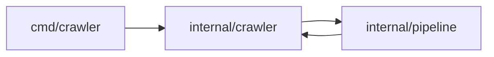
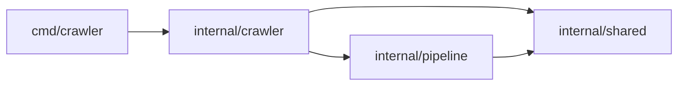

# Fix 2: Import cycle between `crawler` and `pipeline`

## Problem

Initially, the code compiled with this error:

```text
import cycle not allowed: import stack: [crawler/cmd/crawler crawler/internal/crawler crawler/internal/pipeline crawler/internal/crawler]
```

The relevant imports were:

- `crawler/internal/crawler/crawler.go`:
  ```go
  import "crawler/internal/pipeline"
  ```
- `crawler/internal/pipeline/interfaces.go` and other pipeline files:
  ```go
  import "crawler/internal/crawler"
  ```

So the dependency chain looked like:

1. `cmd/crawler` imports `internal/crawler`.
2. `internal/crawler` imports `internal/pipeline`.
3. `internal/pipeline` imports `internal/crawler`.

This closes a loop: `crawler → pipeline → crawler`, which Go does **not** allow.

## Why Go forbids import cycles

Go enforces a *directed acyclic graph* (DAG) of package imports. Cycles are disallowed because they:

- Complicate compilation order.
- Make reasoning about initialization and dependencies harder.
- Usually signal a design that mixes responsibilities across packages.

Whenever you see `import cycle not allowed`, you must change the package layout or dependencies so the cycle is broken.

## Visualizing the problem

The original import relations can be shown as:



Here, `C → B` closes the loop.

## Root Cause

Both `internal/crawler` and `internal/pipeline` needed to use the same types:

- `Item` (URL + depth + HTTP response).
- `WorkTracker` (wrapper around `sync.WaitGroup`).

We had placed these types in the `crawler` package, and the `pipeline` package imported `crawler` to access them. But `crawler` also imported `pipeline` to invoke the pipeline workers, creating the cycle.

## Fix: introduce a shared package

We factored the shared types into a new package that *both* `crawler` and `pipeline` can depend on, but which depends on neither of them:

- New package: `internal/shared` with `types.go` containing:
  - `type Item struct { URL *url.URL; Depth int; Response *http.Response }`
  - `type WorkTracker struct { wg sync.WaitGroup }` with methods `Add`, `Done`, `Wait`.

Then we updated imports and type references:

- In `internal/crawler`:
  - Import `crawler/internal/shared`.
  - Channels and values now use `shared.Item` and `*shared.WorkTracker`.
- In `internal/pipeline`:
  - Replace imports of `crawler/internal/crawler` (where they were only needed for `Item` or `WorkTracker`) with `crawler/internal/shared`.
  - Functions like `FetchWorker`, `ParseWorker`, and `DiscoverWorker` now take/return `shared.Item` and use `*shared.WorkTracker` where needed.

The resulting dependency graph is:



This graph is acyclic: every arrow points "down" towards `internal/shared`, which itself has no imports back into `crawler` or `pipeline`.

## Result

After this refactor:

- The `import cycle not allowed` errors disappeared.
- `internal/crawler` can orchestrate the workers.
- `internal/pipeline` can operate on `shared.Item` and `shared.WorkTracker` without needing to import `crawler`.

## Key Takeaways

- When two packages need the same data structures, consider extracting those structures into a **third, lower-level package**.
- Dependency direction should generally follow layers: high-level → mid-level → low-level, without pointing back up.
- Mermaid or other diagrams can help you visually confirm that your package graph is acyclic.