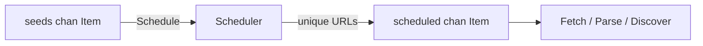

# Fix 4: Incorrect Scheduler method calls in `Crawler.Run`

Associated commit: `9d2f3ff` – `fix: correct method calls for scheduler in Crawler.Run`.

---

## Problem

The `Crawler.Run` method is responsible for wiring together the channels and the `Scheduler` that deduplicates URLs. Before the fix, the code attempted to call methods on the scheduler like this:

```go
scheduler := NewScheduler()

go scheduler.Scheduler.Run(ctx, seeds, scheduled)
...
go scheduler.Scheduler(ctx, discovered, scheduled)
```

This produced compile-time errors similar to:

- `scheduler.Scheduler undefined (type *Scheduler has no field or method Scheduler)`

because the `Scheduler` type is defined roughly as:

```go
type Scheduler struct { /* ... */ }

func (s *Scheduler) Schedule(ctx context.Context, in <-chan Item, out chan<- Item) { /* ... */ }
```

There is **no** field or method named `Scheduler` on the `Scheduler` struct, only the `Schedule` method.

---

## Root Cause

The bug was a simple but important API misuse:

- We created an instance with `scheduler := NewScheduler()`.
- Instead of calling its `Schedule` method, we accidentally wrote `scheduler.Scheduler`.
- On top of that, one of the lines tried to call `Scheduler` as if it were a function:
  - `go scheduler.Scheduler(ctx, discovered, scheduled)`.

So the code both referenced a non-existent member and called it like a function, which the Go compiler correctly rejected.

---

## Fix

The fix in commit `9d2f3ff` replaced both invalid calls with the correct `Schedule` method invocations:

```go
scheduler := NewScheduler()

// Before (invalid):
// go scheduler.Scheduler.Run(ctx, seeds, scheduled)
// After (correct):
go scheduler.Schedule(ctx, seeds, scheduled)

...

// Before (invalid):
// go scheduler.Scheduler(ctx, discovered, scheduled)
// After (correct):
go scheduler.Schedule(ctx, discovered, scheduled)
```

This matches the actual method defined on the `Scheduler` type.

---

## Visual Overview

The correct flow of data and scheduling is:



- `Seeds` is the initial input channel where we send seed URLs.
- `Scheduler` reads from `seeds`, deduplicates URLs, and writes unique items to `scheduled`.
- Downstream workers (fetch/parse/discover) consume from `scheduled`.

Calling `Schedule` directly aligns with this design: the scheduler is a *component* with a single responsibility (routing unique items), not an object containing another nested `Scheduler`.

---

## Key Takeaways

- Go’s method names must match exactly; typos like `Scheduler` vs `Schedule` are caught at compile time.
- When you see errors like "undefined: X" or "type T has no field or method X", double-check:
  - The type definition (`type Scheduler struct { ... }`).
  - The methods attached to that type (`func (s *Scheduler) Schedule(...)`).
- Favor small, well-named methods (like `Schedule`) and let the compiler guide you: if you call something that doesn’t exist, it’s usually a sign that the **concept** or the **name** is slightly off.