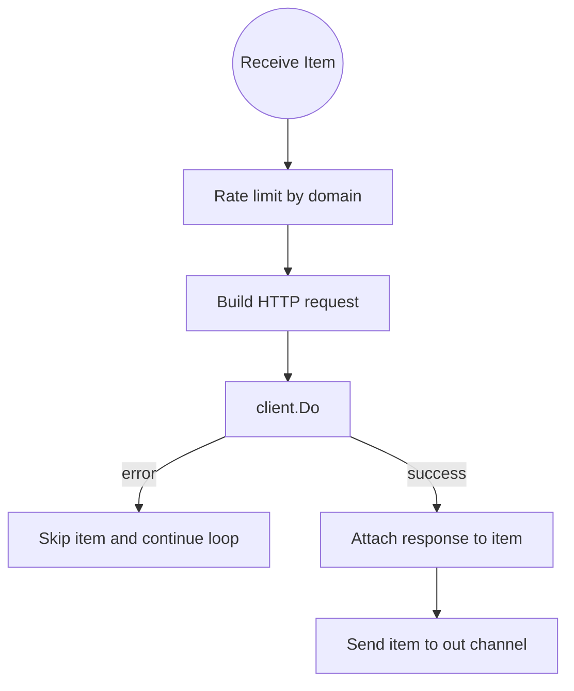

# Fix 5: Handle HTTP request errors in `FetchWorker`

Associated commit: `f67c7ce` – `fix: handle HTTP request errors in FetchWorker`.

---

## Problem

The `FetchWorker` function is responsible for:

1. Reading items from an input channel.
2. Rate-limiting by domain.
3. Building an HTTP request.
4. Executing the request with an `*http.Client`.
5. Attaching the HTTP response to the item and forwarding it downstream.

Before the fix, the implementation was incomplete and contained a compile-time bug:

```go
resp, err := client.Do(req) // this line was *missing* before the fix

item.Response = resp

select {
case out <- item:
case <-ctx.Done():
        resp.Body.Close()
        return
}
```

In the pre-fix version (parent commit of `f67c7ce`), the code looked like this:

```go
// ... request creation above ...

// BUG: resp is not defined, but we try to use it.
item.Response = resp

select {
case out <- item:
case <-ctx.Done():
        resp.Body.Close()
        return
}
```

### Symptoms

- The code would not compile due to `undefined: resp`.
- Even if it did compile, there was **no actual HTTP request** being made, so the pipeline would never get real responses.

---

## Root Cause

We forgot to:

1. Call `client.Do(req)` to actually perform the HTTP request and obtain a `*http.Response`.
2. Check for errors from that call before using the response.

As a result:

- `resp` did not exist in scope at all, causing a compile error.
- There was no error handling for network failures, timeouts, DNS issues, etc.

---

## Fix

Commit `f67c7ce` added the missing request execution and error handling right after building the request:

```go
req, err := http.NewRequestWithContext(ctx, http.MethodGet, item.URL.String(), nil)
if err != nil {
        continue
}

resp, err := client.Do(req)
if err != nil {
        continue
}

item.Response = resp

select {
case out <- item:
case <-ctx.Done():
        resp.Body.Close()
        return
}
```

Key points:

- `client.Do(req)` is now called to perform the HTTP request.
- If `client.Do` returns an error, the worker simply `continue`s the loop, effectively skipping the failed item but keeping the worker alive.
- On context cancellation while sending, we close `resp.Body` to avoid leaking network resources.

---

## Visual Overview of the Fixed Flow



This diagram shows the `FetchWorker` logic after the fix:

- Every item goes through domain-based rate limiting.
- Errors in request construction or execution cause the worker to skip that item and keep processing others.
- Successful responses are attached to the item and passed on.

---

## Key Takeaways

- Always ensure that variables you are using (`resp` in this case) are actually defined and initialized before use.
- Network calls (`client.Do`) should always be checked for errors; ignoring them can cause subtle runtime issues.
- In Go, the compiler is a strong ally: an `undefined` identifier often points exactly to a missing step in your logic (like a missing function call).