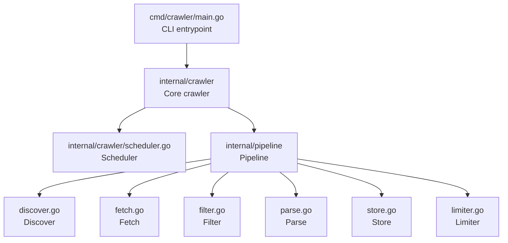

# Architecture

## Overview
- Entry point: Go CLI in `crawler/cmd/crawler/main.go`.
- Core crawler logic and public API live under `crawler/internal/crawler/`.
- Pluggable pipeline stages live under `crawler/internal/pipeline/`.

## Modules
- `cmd/crawler/main.go`
  - Sets up process context and signal handling.
  - Constructs a crawler configuration and starts the crawler.
- `internal/crawler/`
  - Defines the main crawler type (`Crawler`), its configuration (`Config`), and orchestration logic.
  - Provides `New` and `Run` as referenced from `main.go`.
  - Contains supporting types like `Item`, `Schedular`, and work-related helpers.
- `internal/pipeline/`
  - Hosts pluggable pipeline stages (`discover`, `fetch`, `filter`, `parse`, `store`) and related infrastructure (`interfaces`, `limiter`).
  - Each stage is separated into its own file for clarity and independent evolution.

## High-Level Interactions
- The CLI entrypoint configures and starts the crawler through the internal package API.
- The core crawler coordinates scheduling of crawl work and interaction with pipeline stages.
- Pipeline stages process crawl items in sequence (e.g., discover → fetch → filter → parse → store), with optional limiting.

## Mermaid System Diagram

## Notes
- The above diagram reflects the current package layout and function calls in `main.go`.
