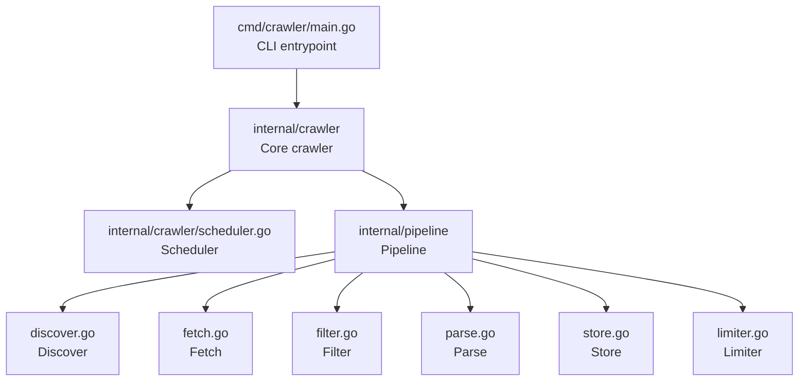

# Architecture

## Overview
- Entry point: Go CLI in `crawler/cmd/crawler/main.go`.
- Core crawler orchestration lives under `crawler/internal/crawler/`.
- Pluggable pipeline stages and infrastructure live under `crawler/internal/pipeline/`.

## Modules
- `cmd/crawler/main.go`
  - Sets up process context and signal handling.
  - Constructs a `Crawler` via functional options (e.g., worker count, max depth) and starts it.
- `internal/crawler/`
  - Defines the main crawler type (`Crawler`) and its orchestration logic.
  - Provides `New`, `WithWorkerCount`, and `WithMaxDepth` as referenced from `main.go`.
  - Contains supporting types like `Item`, `Schedular`, and `WorkTracker`.
- `internal/pipeline/`
  - Hosts pluggable pipeline stages (`discover`, `fetch`, `filter`, `parse`, `store`) and related infrastructure (`interfaces`, `limiter`).
  - The current implementation focuses on wiring and rate-limiting primitives; most stage files are skeletal and document future responsibilities.

## High-Level Interactions
- The CLI entrypoint configures and starts the crawler through the internal package API.
- The core crawler coordinates scheduling of crawl work, concurrency, and interaction with pipeline stages.
- Conceptually, pipeline stages process crawl items in sequence (e.g., discover → fetch → filter → parse → store), with optional limiting; concrete logic is still being built out.

## Mermaid System Diagram

```mermaid
flowchart TD
  CLI[cmd/crawler/main.go<br/>CLI entrypoint] --> CORE[internal/crawler<br/>Core crawler]
  CORE --> SCHED[internal/crawler/scheduler.go<br/>Scheduler]
  CORE --> PIPE[internal/pipeline<br/>Pipeline]
  PIPE --> DISC[discover.go<br/>Discover]
  PIPE --> FETCH[fetch.go<br/>Fetch]
  PIPE --> FILTER[filter.go<br/>Filter]
  PIPE --> PARSE[parse.go<br/>Parse]
  PIPE --> STORE[store.go<br/>Store]
  PIPE --> LIMIT[limiter.go<br/>Limiter]
```

## Notes
- The above diagram reflects the current package layout and function calls in `main.go` and `internal/crawler`.
- Some pipeline stage files are placeholders; their responsibilities are documented even where implementations are not yet complete.
