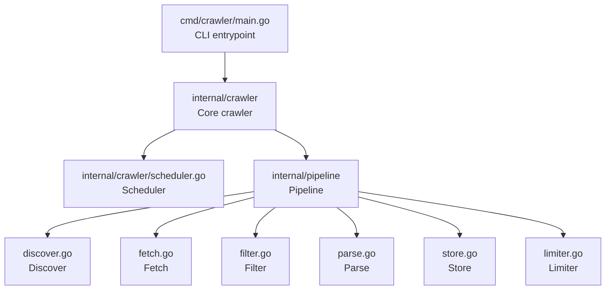

# Architecture

## Overview
- Entry points:
  - Go CLI in `crawler/cmd/crawler/main.go`.
  - Web UI in `crawler/cmd/webui/main.go`.
- Core crawler orchestration lives under `crawler/internal/crawler/`.
- Pluggable pipeline stages and infrastructure live under `crawler/internal/pipeline/`.
- Shared types (including the high-level use-case / mode) live under `crawler/internal/shared/`.

## Modules
- `cmd/crawler/main.go`
  - Sets up process context and signal handling.
  - Parses flags for worker count, max depth, seed URL, and a **mode** flag that selects one of three high-level use cases:
    - Track my favourite blogs
    - Internal Site Health Checker
    - Data Pipeline Search Index
  - Constructs a `Crawler` via functional options and starts it.
- `cmd/webui/main.go`
  - Serves a small HTML form for launching crawls from the browser.
  - Lets the user configure URL, workers, depth, and the same three modes via radio buttons.
- `internal/crawler/`
  - Defines the main crawler type (`Crawler`) and its orchestration logic.
  - Provides options like `WithWorkerCount`, `WithMaxDepth`, `WithSeedURL`, and `WithUseCase` as referenced from the entrypoints.
  - Contains supporting types like `Schedular` and `WorkTracker`.
- `internal/shared/`
  - Defines shared data structures such as `Item`, which now carries the selected **use case** (`UseCaseTrackBlogs`, `UseCaseSiteHealth`, `UseCaseSearchIndex`).
- `internal/pipeline/`
  - Hosts pluggable pipeline stages (`discover`, `fetch`, `filter`, `parse`, `store`) and related infrastructure (`interfaces`, `limiter`).
  - The current implementation focuses on wiring and rate-limiting primitives; most stage files are skeletal and document future responsibilities.

## High-Level Interactions
- The CLI and Web UI entrypoints configure and start the crawler through the internal package API.
- The core crawler coordinates scheduling of crawl work, concurrency, and interaction with pipeline stages.
- A selected **mode** flows from the entrypoint into `internal/shared.Item` values and can be used by stages (such as fetch or store) to log or behave differently for each use case.
- Conceptually, pipeline stages process crawl items in sequence (e.g., discover → fetch → filter → parse → store), with optional limiting; concrete logic is still being built out.

## Mermaid System Diagram

```mermaid
flowchart TD
  CLI[cmd/crawler/main.go<br/>CLI entrypoint] --> CORE[internal/crawler<br/>Core crawler]
  CORE --> SCHED[internal/crawler/scheduler.go<br/>Scheduler]
  CORE --> PIPE[internal/pipeline<br/>Pipeline]
  PIPE --> DISC[discover.go<br/>Discover]
  PIPE --> FETCH[fetch.go<br/>Fetch]
  PIPE --> FILTER[filter.go<br/>Filter]
  PIPE --> PARSE[parse.go<br/>Parse]
  PIPE --> STORE[store.go<br/>Store]
  PIPE --> LIMIT[limiter.go<br/>Limiter]
```

## Notes
- The above diagram reflects the current package layout and function calls in `main.go` and `internal/crawler`.
- Some pipeline stage files are placeholders; their responsibilities are documented even where implementations are not yet complete.
