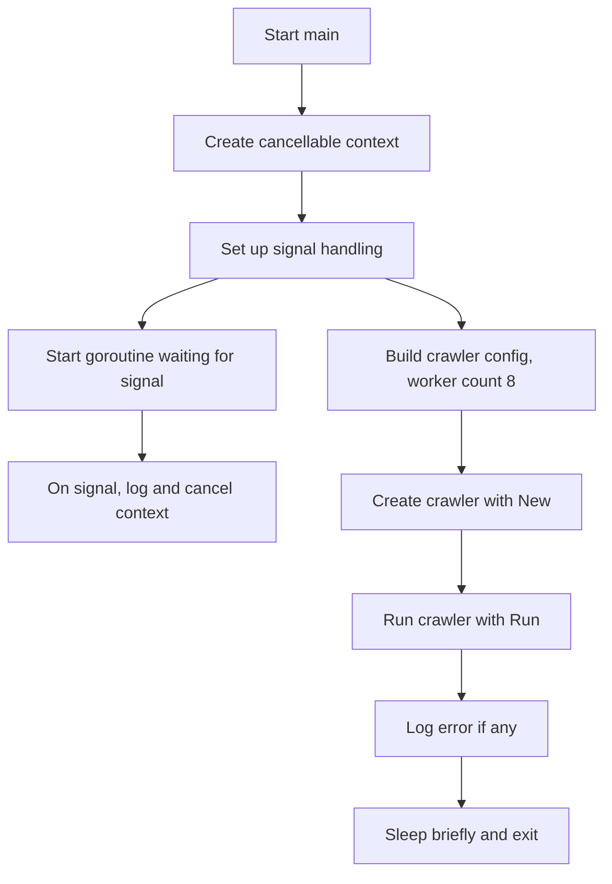

# cmd/crawler/main.go

## 1. Overview
- Purpose: Provide the CLI entrypoint for the crawler application.
- Problem it solves: Starts the crawler, sets up graceful shutdown via context cancellation and OS signal handling.
- High-level responsibility: Wire up configuration, create the crawler instance, run it, and handle termination.

## 2. File Location
- Relative path (from repo root): `crawler/cmd/crawler/main.go`

## 3. Key Components
- `func main()`
  - Application entrypoint; orchestrates the overall start and shutdown sequence.
- `context.WithCancel(context.Background())`
  - Creates a cancellable context used to control the lifetime of the crawler.
- `sigCh := make(chan os.Signal, 1)` and `signal.Notify(sigCh, syscall.SIGINT, syscall.SIGTERM)`
  - Channel and subscription used to listen for termination signals (Ctrl+C, system shutdown).
- Goroutine reading from `sigCh`
  - Logs the received signal and invokes `cancel()` to propagate shutdown via the context.
- `crawler.Config{ WoekerCount: 8 }`
  - Configuration struct (defined in `internal/crawler`, not yet implemented) specifying crawler parameters such as worker count.
- `crawler.New(cfg)`
  - Factory function (expected in `internal/crawler`) that constructs a new crawler instance from the config.
- `c.Run(ctx)`
  - Starts the crawler using the provided context; returns an error if the crawler exits unexpectedly.
- `time.Sleep(100 * time.Millisecond)`
  - Optional short delay after shutdown to allow any asynchronous cleanup to finish.

## 4. Execution Flow
1. Create a root context with cancellation capability.
2. Initialize an OS signal channel and register for `SIGINT` and `SIGTERM`.
3. Start a goroutine that waits for a signal, logs it, and cancels the context.
4. Build a `crawler.Config` with a worker count of 8.
5. Call `crawler.New(cfg)` to obtain a crawler instance.
6. Invoke `c.Run(ctx)` to start the crawler and block until it returns.
7. Log any error returned by `c.Run`.
8. Sleep briefly to allow in-flight cleanup before process exit.

## 5. Data Flow
- **Inputs**
  - OS termination signals (`SIGINT`, `SIGTERM`).
  - Hard-coded configuration values (e.g., worker count).
- **Processing steps**
  - Transform OS signals into context cancellation.
  - Pass configuration into the internal crawler constructor.
  - Pass the context into `Run` to control the crawler lifetime.
- **Outputs**
  - Logs for shutdown signals and crawler exit errors.
  - Cancellation propagated through the context to downstream components.
- **Dependencies**
  - Standard library: `context`, `log`, `os`, `os/signal`, `syscall`, `time`.
  - Internal module: `crawler/internal/crawler` (for `Config`, `New`, and `Run`).

## 6. Mermaid Diagrams


## 7. Error Handling & Edge Cases
- If `c.Run(ctx)` returns an error, it is logged but not retried; the process then continues to shutdown.
- If no signal is ever received, the program runs until `c.Run` returns on its own.
- If a signal is received before the crawler is fully initialized, the context is still canceled, and `Run` should respect that (implementation to be provided in `internal/crawler`).
- A fixed sleep may be insufficient for very long-running cleanup; this is a simple, bounded wait.

## 8. Example Usage
- Run the crawler from the repository root:
  ```bash
  cd crawler
  go run ./cmd/crawler
  ```
- Example logs during shutdown (illustrative):
  ```text
  2026/02/12 10:15:30 Received signal: interrupt, shutting down
  2026/02/12 10:15:30 crawler exited with error: <nil>
  ```
