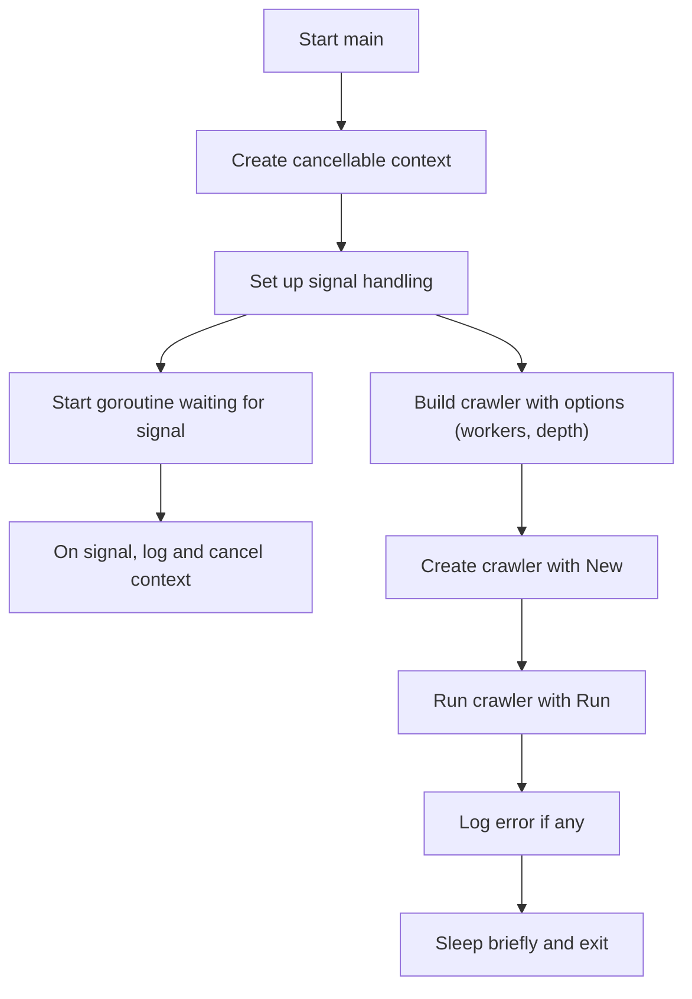

# cmd/crawler/main.go

## 1. Overview
- Purpose: Provide the CLI entrypoint for the crawler application.
- Problem it solves: Starts the crawler, sets up graceful shutdown via context cancellation and OS signal handling.
- High-level responsibility: Parse flags (workers, depth, URL, and mode), create the crawler instance, run it, and handle termination.

## 2. File Location
- Relative path (from repo root): `crawler/cmd/crawler/main.go`

## 3. Key Components
- `func main()`
  - Application entrypoint; orchestrates the overall start and shutdown sequence.
- `context.WithCancel(context.Background())`
  - Creates a cancellable context used to control the lifetime of the crawler.
- `sig := make(chan os.Signal, 1)` and `signal.Notify(sig, syscall.SIGINT, syscall.SIGTERM)`
  - Channel and subscription used to listen for termination signals (Ctrl+C, system shutdown).
- Goroutine reading from `sig`
  - Logs a shutdown message and invokes `cancel()` to propagate shutdown via the context.
  - Command-line flags:
    - `-workers` (int): number of concurrent worker goroutines.
    - `-depth` (int): maximum crawl depth.
    - `-url` (string): seed URL to start crawling from.
    - `-mode` (string/int): high-level use case for the crawl (`1`/`blogs`, `2`/`health`, `3`/`search`).
- `crawler.New(...)`
  - Uses functional options from `internal/crawler` to configure the crawler instance.
  - `WithWorkerCount` sets the number of concurrent fetch workers.
  - `WithMaxDepth` bounds the crawl depth from the initial seeds.
  - `WithSeedURL` injects the user-provided URL.
  - `WithUseCase` injects the selected use case into the crawler so it can flow into items and workers.
- `c.Run(ctx)`
  - Starts the crawler using the provided context; returns an error when the context is canceled or if it aborts early.

### Why this is idiomatic
- context.Context is rooted in main
- Signals only cancel context — they don’t “do work”
- No global state
- No os.Exit

#### ⚠️ Interview red flag: doing cleanup inside the signal handler.

## 4. Execution Flow
1. Create a root context with cancellation capability.
2. Initialize an OS signal channel and register for `SIGINT` and `SIGTERM`.
3. Start a goroutine that waits for a signal, logs it, and cancels the context.
4. Construct a crawler instance via `crawler.New`, passing `WithWorkerCount` and `WithMaxDepth` options.
5. Invoke `c.Run(ctx)` to start the crawler and block until it returns.
6. Log any error returned by `c.Run`.

## 5. Data Flow
- **Inputs**
  - OS termination signals (`SIGINT`, `SIGTERM`).
  - Hard-coded configuration values (e.g., worker count).
- **Processing steps**
  - Transform OS signals into context cancellation.
  - Pass configuration into the internal crawler constructor.
  - Pass the context into `Run` to control the crawler lifetime.
- **Outputs**
  - Logs for shutdown signals and crawler exit errors.
  - Cancellation propagated through the context to downstream components.
- **Dependencies**
  - Standard library: `context`, `log`, `os`, `os/signal`, `syscall`.
  - Internal module: `crawler/internal/crawler` (for `New`, `WithWorkerCount`, `WithMaxDepth`, and `Run`).

## 6. Mermaid Diagrams

```mermaid
flowchart TD
  A["Start main"] --> B["Create cancellable context"]
  B --> C["Set up signal handling"]
  C --> D["Start goroutine waiting for signal"]
  D --> E["On signal, log and cancel context"]
  C --> F["Build crawler with options (workers, depth)"]
  F --> G["Create crawler with New"]
  G --> H["Run crawler with Run"]
  H --> I["Log error if any"]
  I --> J["Sleep briefly and exit"]
```

## 7. Error Handling & Edge Cases
- If `c.Run(ctx)` returns an error, it is logged but not retried; the process then continues to shutdown.
- If no signal is ever received, the program runs until `c.Run` returns on its own.
- If a signal is received before the crawler is fully initialized, the context is still canceled, and `Run` respects that by unblocking on `<-ctx.Done()`.

## 8. Example Usage
- Run the crawler from the repository root:
  ```bash
  cd crawler
  go run ./cmd/crawler
  ```
- Example logs during shutdown (illustrative):
  ```text
  2026/02/12 10:15:30 Received signal: interrupt, shutting down
  2026/02/12 10:15:30 crawler exited with error: <nil>
  ```
