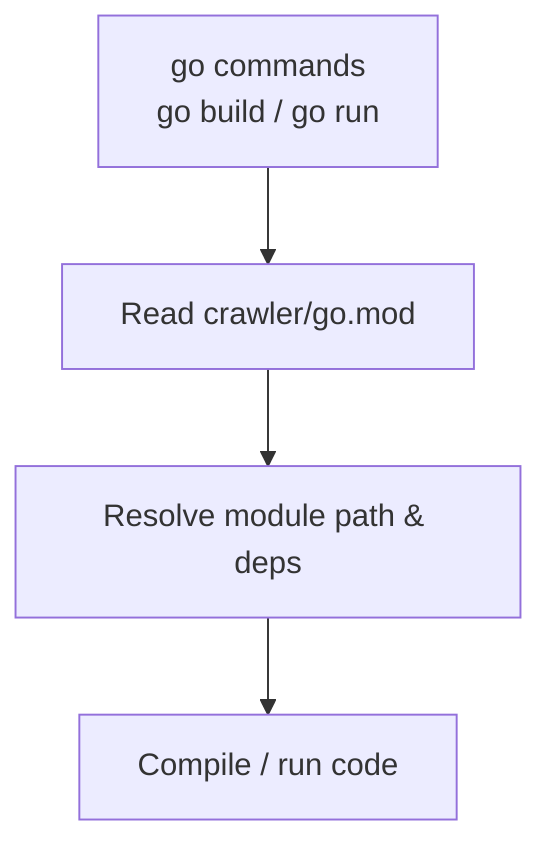

# go.mod

## 1. Overview
- Purpose: Declare the Go module for the crawler project and manage dependencies.
- Current state: The `crawler/go.mod` file exists but is empty in this snapshot of the repository.
- High-level responsibility: Once populated, it will define the module path and any required dependencies.

## 2. File Location
- Relative path (from repo root): `crawler/go.mod`

## 3. Key Components
- Module declaration (planned): `module <module-path>`.
- Go version (planned): `go <version>`.
- Require and replace directives (planned) for external dependencies.

As of now, none of these components are present in the file.

## 4. Execution Flow
- `go.mod` is not executed directly; it is consumed by the Go toolchain.
- When populated, it will influence how commands like `go build`, `go test`, and `go run` resolve module paths and dependencies.

## 5. Data Flow
- **Inputs**: Not applicable at runtime; this is configuration consumed by the Go toolchain.
- **Processing**: The Go toolchain reads `go.mod` to determine module identity and dependencies.
- **Outputs**: Affects module resolution and build behavior.
- **Dependencies**: None declared yet.

## 6. Mermaid Diagrams


## 7. Error Handling & Edge Cases
- With an empty `go.mod`, module-aware commands may fail or treat the project as not fully configured.
- Once content is added, common errors include invalid module paths, incompatible Go versions, and missing dependencies.

## 8. Example Usage
- Initialize the module (once you decide on a module path):
  ```bash
  cd crawler
  go mod init example.com/your/module
  ```
- Add a dependency (example):
  ```bash
  go get github.com/some/library@latest
  ```
