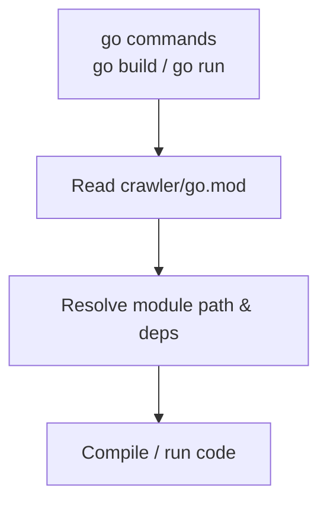

# go.mod

## 1. Overview
- Purpose: Declare the Go module for the crawler project and manage dependencies.
- Current state: The `crawler/go.mod` file declares the module path and Go version.
- High-level responsibility: Define the module path and Go version for the crawler code.

## 2. File Location
- Relative path (from repo root): `crawler/go.mod`

## 3. Key Components
- Module declaration: `module crawler`.
- Go version: `go 1.25`.
- No `require` or `replace` directives are currently present.

## 4. Execution Flow
- `go.mod` is not executed directly; it is consumed by the Go toolchain.
- When populated, it will influence how commands like `go build`, `go test`, and `go run` resolve module paths and dependencies.

## 5. Data Flow
- **Inputs**: Not applicable at runtime; this is configuration consumed by the Go toolchain.
- **Processing**: The Go toolchain reads `go.mod` to determine module identity and dependencies.
- **Outputs**: Affects module resolution and build behavior.
- **Dependencies**: None declared yet.

## 6. Mermaid Diagrams

```mermaid
flowchart TD
    A[go commands<br/>go build / go run] --> B[Read crawler/go.mod]
    B --> C[Resolve module path & deps]
    C --> D[Compile / run code]
```

## 7. Error Handling & Edge Cases
- With only a module path and Go version, the project builds as long as it has no external dependencies.
- Once dependencies are added, common errors include invalid module paths, incompatible Go versions, and missing or conflicting dependency versions.

## 8. Example Usage
- Initialize the module (once you decide on a module path):
  ```bash
  cd crawler
  go mod init example.com/your/module
  ```
- Add a dependency (example):
  ```bash
  go get github.com/some/library@latest
  ```
