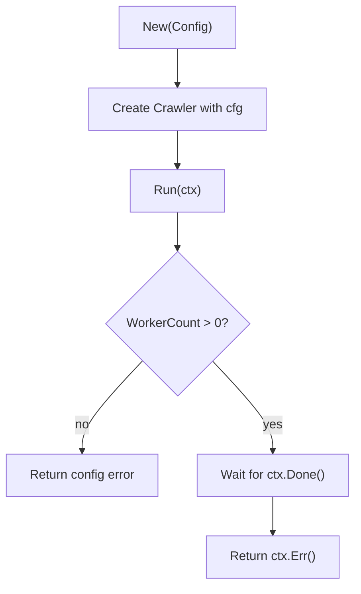

# internal/crawler/crawler.go

## 1. Overview
- Purpose: Define the core `Crawler` type, its configuration, and the main `Run` loop.
- Problem it solves: Provides a single entrypoint for running the crawler under a `context.Context`, validating configuration up front.
- High-level responsibility: Hold configuration, construct crawler instances, and block until the context is canceled.

## 2. File Location
- Relative path (from repo root): `crawler/internal/crawler/crawler.go`

## 3. Key Components
- `type Config struct { WorkerCount int }`
	- Configuration for the crawler; currently only a worker count.
- `type Crawler struct { cfg Config }`
	- Concrete crawler type that stores the effective configuration.
- `func New(cfg Config) *Crawler`
	- Constructor that wraps the provided configuration in a new `Crawler` instance.
- `func (c *Crawler) Run(ctx context.Context) error`
	- Validates configuration (`WorkerCount` must be > 0).
	- Blocks until `ctx.Done()` is signaled.
	- Returns `ctx.Err()` when the context is canceled or times out.

## 4. Execution Flow
1. Call `New(cfg)` with a `Config` value to create a `Crawler`.
2. Call `Run(ctx)` on the returned crawler instance.
3. Inside `Run`:
	 - If `cfg.WorkerCount <= 0`, return an error immediately.
	 - Otherwise, wait on `<-ctx.Done()`.
	 - When the context is canceled, return `ctx.Err()`.

## 5. Data Flow
- **Inputs**
	- `Config` provided to `New`.
	- `ctx context.Context` provided to `Run`.
- **Processing steps**
	- Validate configuration (worker count must be positive).
	- Block until context completion.
- **Outputs**
	- An `error` from `Run`: either a configuration error or the context error.
- **Dependencies**
	- `context` from the standard library.
	- `errors` from the standard library.

## 6. Mermaid Diagrams


## 7. Error Handling & Edge Cases
- If `WorkerCount <= 0`, `Run` returns `errors.New("worker count must be > 0")` immediately.
- If the context is never canceled, `Run` blocks indefinitely.
- When the context is canceled or times out, `Run` returns `ctx.Err()` (e.g., `context.Canceled` or `context.DeadlineExceeded`).

## 8. Example Usage
```go
cfg := crawler.Config{WorkerCount: 8}
c := crawler.New(cfg)

if err := c.Run(ctx); err != nil {
		log.Printf("crawler exited: %v", err)
}
```

## Notes
### This is the brain, not a god object.

``` internal/crawler/crawler.go  ```

### Why this used to look “empty”

#### Because control flow comes before work.

### Most junior Go code:
- spawns goroutines first
- figures out shutdown later
- deadlocks under pressure
#### We are doing the opposite.