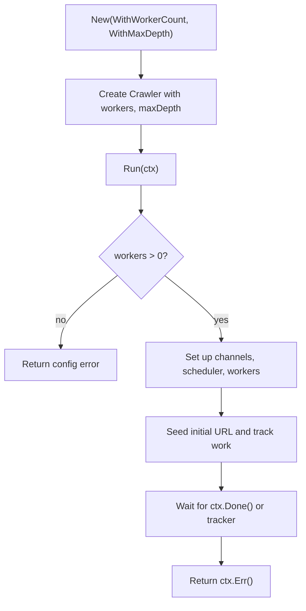

# internal/crawler/crawler.go

## 1. Overview
- Purpose: Define the core `Crawler` type, its configuration via functional options, and the main `Run` loop.
- Problem it solves: Provides a single entrypoint for running a concurrent crawler under a `context.Context`, wiring together workers, scheduler, and pipeline channels.
- High-level responsibility: Hold configuration (worker count, max depth), construct crawler instances, and orchestrate the crawl until the context is canceled.

## 2. File Location
- Relative path (from repo root): `crawler/internal/crawler/crawler.go`

## 3. Key Components
- `type Crawler struct { workers int; maxDepth int; seedURL string; mode shared.UseCase }`
	- Holds crawler configuration:
	  - `workers`: number of concurrent fetch workers.
	  - `maxDepth`: maximum crawl depth from the initial seed URLs.
	  - `seedURL`: starting URL for the crawl.
	  - `mode`: selected high-level use case (Track Blogs, Site Health, Search Index).
- `type Option func(*Crawler)`
	- Functional option type used to configure a `Crawler` at construction time.
- `func WithWorkerCount(n int) Option`
	- Configures the number of concurrent workers.
-- `func WithMaxDepth(d int) Option`
	- Configures the maximum crawl depth.
- `func WithSeedURL(u string) Option`
	- Configures the starting seed URL.
- `func WithUseCase(mode shared.UseCase) Option`
	- Configures the high-level use case that flows into items and workers.
-- `func New(opts ...Option) *Crawler`
	- Constructor that applies options to a `Crawler`.
	- Defaults: `workers = 4`, `maxDepth = 1`, `seedURL = "https://example.com"`, `mode = UseCaseTrackBlogs` if not overridden.
- `func (c *Crawler) Run(ctx context.Context) error`
	- Validates configuration (`workers` must be > 0).
	- Constructs channels for each stage: `seeds`, `scheduled`, `fetched`, `parsed`, `discovered`.
	- Creates a scheduler and runs it.
	- Creates an HTTP client and domain limiter from `internal/pipeline`.
	- Starts a pool of fetch workers.
	- Starts parse and discover workers and wires them with channels.
	- Uses a `WorkTracker` to know when all work is done and trigger cancellation.
	- Parses and normalizes the configured seed URL.
	- Seeds the crawl with that URL and depth 0, attaching the configured `mode` to the initial `Item`.
	- Blocks on `<-ctx.Done()` and returns `ctx.Err()`.

## 4. Execution Flow
1. Construct a `Crawler` using `New`, optionally passing `WithWorkerCount` and `WithMaxDepth`.
2. Call `Run(ctx)` on the returned crawler instance.
3. Inside `Run`:
	- If `workers <= 0`, return an error immediately.
	- Create a `WorkTracker` and derive a cancellable context.
	- Initialize channels: `seeds`, `scheduled`, `fetched`, `parsed`, `discovered`.
	- Create a `Schedular` and run its scheduling loop.
	- Create an HTTP client and domain limiter via the `pipeline` package.
	- Start `workers` number of fetch goroutines and wait for them via a `sync.WaitGroup`.
	- Start parse and discover workers to process fetched and parsed items.
	- Start a goroutine that waits on the `WorkTracker` and cancels the context when all work is done.
	- Seed the `seeds` channel with an initial URL and depth 0, incrementing the tracker.
	- Block until the context is done, then return `ctx.Err()`.

## 5. Data Flow
- **Inputs**
	- Functional options (`WithWorkerCount`, `WithMaxDepth`) provided to `New`.
	- `ctx context.Context` provided to `Run`.
- **Processing steps**
	- Validate configuration (worker count must be positive).
	- Set up channels, scheduler, workers, and pipeline wiring.
	- Seed the crawl and track outstanding work via `WorkTracker`.
	- Cancel the internal context when all work is done or when the parent context is canceled.
- **Outputs**
	- An `error` from `Run`: either a configuration error or the context error.
	- Side-effectful work performed by pipeline workers (fetching, parsing, discovering) as they are implemented.
- **Dependencies**
	- `context`, `errors`, `net/url`, `sync`, `time` from the standard library.
	- Internal packages: `internal/crawler` (for `WorkTracker`, `Schedular`, `Item`) and `internal/pipeline` for HTTP client, limiter, and workers.

## 6. Mermaid Diagrams

```mermaid
flowchart TD
	A["New(WithWorkerCount, WithMaxDepth)"] --> B["Create Crawler with workers, maxDepth"]
	B --> C["Run(ctx)"]
	C --> D{"workers > 0?"}
	D -->|no| E["Return config error"]
	D -->|yes| F["Set up channels, scheduler, workers"]
	F --> G["Seed initial URL and track work"]
	G --> H["Wait for ctx.Done() or tracker"]
	H --> I["Return ctx.Err()"]
```

## 7. Error Handling & Edge Cases
- If `workers <= 0`, `Run` returns `errors.New("worker count must be > 0")` immediately.
- If the context is never canceled and the tracker never reaches zero, `Run` will continue to block.
- When the context is canceled or times out, `Run` returns `ctx.Err()` (e.g., `context.Canceled` or `context.DeadlineExceeded`).
- The initial seed URL is currently hard-coded; misconfiguration at the pipeline level may surface as errors when stages are implemented.

## 8. Example Usage
```go
c := crawler.New(
	crawler.WithWorkerCount(8),
	crawler.WithMaxDepth(3),
)

if err := c.Run(ctx); err != nil {
	log.Printf("crawler exited: %v", err)
}
```

## Notes
### This is the brain, not a god object.

``` internal/crawler/crawler.go  ```

### Why this used to look “empty”

#### Because control flow comes before work.

### Most junior Go code:
- spawns goroutines first
- figures out shutdown later
- deadlocks under pressure
#### We are doing the opposite.