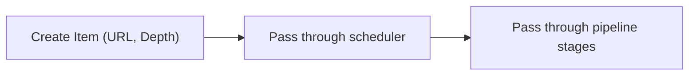

# internal/crawler/item.go

## 1. Overview
- Purpose: Define the `Item` type representing a single crawl unit.
- Problem it solves: Encapsulates a target URL and its crawl depth in a single struct.
- High-level responsibility: Serve as the basic piece of data passed through the crawler and scheduler.

## 2. File Location
- Relative path (from repo root): `crawler/internal/crawler/item.go`

## 3. Key Components
- `type Item struct { URL *url.URL; Depth int }`
	- `URL *url.URL`: Pointer to a parsed URL for the item.
	- `Depth int`: Current depth of this item in the crawl (e.g., starting URL at depth 0).

## 4. Execution Flow
- `Item` is a data container and does not define its own control flow.
- It is expected to be created by producer code and passed through channels and pipeline stages.

## 5. Data Flow
- **Inputs**
	- Parsed `*url.URL` values and associated depth levels from code that constructs `Item` instances.
- **Processing steps**
	- Transformations are performed by other components (scheduler, pipeline); this file only defines the shape of the data.
- **Outputs**
	- `Item` values flowing between internal components.
- **Dependencies**
	- `net/url` from the standard library.

## 6. Mermaid Diagrams


## 7. Error Handling & Edge Cases
- This file defines a type only; no validation is performed here.
- Callers are responsible for providing non-nil `URL` values and sensible `Depth` values.

## 8. Example Usage
```go
u, _ := url.Parse("https://example.com")
item := crawler.Item{URL: u, Depth: 0}
```

### Notes
#### Why a pointer to url.URL?
- Parsing once avoids repeated allocations.
- Ownership is clear.