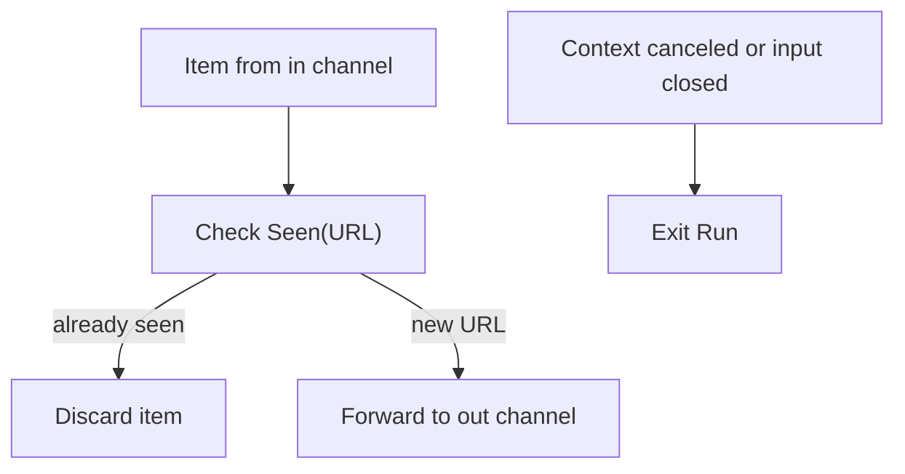

# internal/crawler/scheduler.go

## 1. Overview
- Purpose: Implement a simple scheduler that deduplicates URLs and forwards unseen items for processing.
- Problem it solves: Prevents re-processing the same URL multiple times and coordinates item flow between channels.
- High-level responsibility: Track seen URLs safely across goroutines and route new items downstream until shutdown.

## 2. File Location
- Relative path (from repo root): `crawler/internal/crawler/scheduler.go`

## 3. Key Components
- `type Schedular struct`
  - Holds a `seen` map from URL string to empty struct and a `sync.Mutex` `mu` to guard concurrent access.
- `func NewSchedular() *Schedular`
  - Constructor that initializes the `seen` map.
- `func (s *Schedular) Seen(u string) bool`
  - Checks if a URL string has been seen; if not, records it as seen.
  - Returns `true` if the URL was already present, `false` otherwise.
- `func (s *Schedular) Run(ctx context.Context, in <-chan Item, out chan<- Item)`
  - Main scheduling loop.
  - Listens on the input channel and forwards only unseen items to the output channel, respecting context cancellation.

## 4. Execution Flow
1. A `Schedular` instance is created via `NewSchedular`.
2. `Run` is invoked with a context, an input channel of `Item`, and an output channel of `Item`.
3. Inside an infinite loop, `Run` selects on:
   - `ctx.Done()`: exits immediately when the context is canceled.
   - `in` channel:
     - If the channel is closed (`ok == false`), `Run` returns.
     - Otherwise, it receives an `Item`.
4. For each received item, `Run` calls `s.Seen(item.URL.String())`:
   - If `Seen` returns `true`, the item is discarded.
   - If `Seen` returns `false`, the item is sent to `out`.

## 5. Data Flow
- **Inputs**
  - `ctx`: controls lifetime; when canceled, stops the scheduler.
  - `in <-chan Item`: stream of items that may include duplicates by URL.
- **Processing steps**
  - Convert each item's `URL` to a string.
  - Check and update the `seen` map under a mutex.
  - Filter out duplicates.
- **Outputs**
  - `out chan<- Item`: receives only the first occurrence of each URL.
- **Dependencies**
  - `context` for cancellation.
  - `sync` for `Mutex`.
  - Local `Item` type from `internal/crawler/item.go`.

## 6. Mermaid Diagrams


## 7. Error Handling & Edge Cases
- No explicit error values are returned; control flow is driven by context and channel closure.
- If `ctx` is canceled, `Run` stops promptly without draining `in`.
- If `in` is closed, `Run` returns after processing remaining buffered values (if any).
- The `seen` map grows without bound; in long-running crawls, additional eviction logic might be required.

## 8. Example Usage
```go
sched := crawler.NewSchedular()
ctx, cancel := context.WithCancel(context.Background())
defer cancel()

in := make(chan crawler.Item)
out := make(chan crawler.Item)

go sched.Run(ctx, in, out)

// Send items into in, read unique items from out.
```
