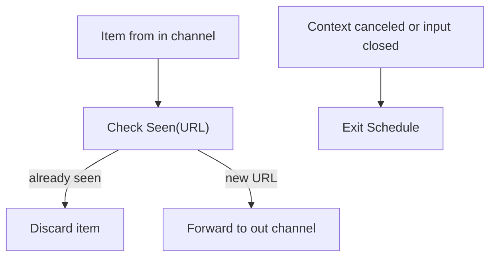

# internal/crawler/scheduler.go

## 1. Overview
- Purpose: Implement a simple scheduler that deduplicates URLs and forwards unseen items for processing.
- Problem it solves: Prevents re-processing the same URL multiple times and coordinates item flow between channels.
- High-level responsibility: Track seen URLs safely across goroutines and route new items downstream until shutdown.

## 2. File Location
- Relative path (from repo root): `crawler/internal/crawler/scheduler.go`

## 3. Key Components
- `type Scheduler struct`
  - Holds a `seen` map from URL string to empty struct and a `sync.Mutex` `mu` to guard concurrent access.
- Option: `maxUnique` (passed to `NewScheduler`) caps the number of unique URLs scheduled in a single crawl.
- `func NewScheduler(maxUnique int) *Scheduler`
  - Constructor that initializes the `seen` map and sets the max-unique cap.
- `func (s *Scheduler) Schedule(ctx context.Context, in <-chan shared.Item, out chan<- shared.Item, tracker *shared.WorkTracker)`
  - Main scheduling loop.
  - Listens on the input channel and forwards only unseen items to the output channel, respecting context cancellation.
  - If `tracker` is provided, duplicates (and items dropped due to the max-unique cap) call `tracker.Done()` so work accounting stays correct.

## 4. Execution Flow
1. A `Scheduler` instance is created via `NewScheduler(maxUnique)`.
2. `Schedule` is invoked with a context, an input channel of `shared.Item`, and an output channel of `shared.Item`.
3. Inside an infinite loop, `Schedule` selects on:
   - `ctx.Done()`: exits immediately when the context is canceled.
   - `in` channel:
     - If the channel is closed (`ok == false`), `Schedule` returns.
     - Otherwise, it receives an `Item`.
4. For each received item, `Schedule`:
  - Converts `item.URL` to a string key.
  - Checks and updates the `seen` map under the mutex.
  - Discards items whose URL has already been seen.
  - Discards new items once `maxUnique` unique URLs have been scheduled (if `maxUnique > 0`).
  - Sends unseen items to `out`, again respecting context cancellation.

## 5. Data Flow
- **Inputs**
  - `ctx`: controls lifetime; when canceled, stops the scheduler.
  - `in <-chan Item`: stream of items that may include duplicates by URL.
- **Processing steps**
  - Convert each item's `URL` to a string.
  - Check and update the `seen` map under a mutex.
  - Filter out duplicates.
- **Outputs**
  - `out chan<- Item`: receives only the first occurrence of each URL.
- **Dependencies**
  - `context` for cancellation.
  - `sync` for `Mutex`.
  - `crawler/internal/shared` for `shared.Item` and `shared.WorkTracker`.

## 6. Mermaid Diagrams

```mermaid
flowchart TD
  A["Item from in channel"] --> B["Check Seen(URL)"]
  B -->|already seen| C["Discard item"]
  B -->|new URL| D["Forward to out channel"]
  E["Context canceled or input closed"] --> F["Exit Schedule"]
```

## 7. Error Handling & Edge Cases
- No explicit error values are returned; control flow is driven by context and channel closure.
- If `ctx` is canceled, `Run` stops promptly without draining `in`.
- If `in` is closed, `Run` returns after processing remaining buffered values (if any).
- The `seen` map is bounded by `maxUnique` when set (the crawler sets this to `maxPages`).

## 8. Example Usage
```go
sched := crawler.NewScheduler(40)
ctx, cancel := context.WithCancel(context.Background())
defer cancel()

tracker := &shared.WorkTracker{}
in := make(chan shared.Item)
out := make(chan shared.Item)

go sched.Schedule(ctx, in, out, tracker)

// Send items into in, read unique items from out.
```
