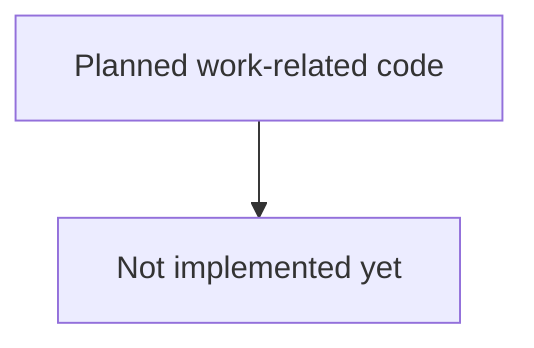

# internal/crawler/work.go

## 1. Overview
- Purpose: Reserved for future work-related structures or worker orchestration logic in the crawler.
- Current state: The file exists but is empty.
- High-level responsibility (implied): Provide abstractions around units of work and/or worker pools once implemented.

## 2. File Location
- Relative path (from repo root): `crawler/internal/crawler/work.go`

## 3. Key Components
- No types, functions, or variables are currently defined.

## 4. Execution Flow
- No runtime behavior is present yet.
- This file is expected to support the crawler's internal execution model in future iterations.

## 5. Data Flow
- **Inputs**: None yet.
- **Processing steps**: None yet.
- **Outputs**: None yet.
- **Dependencies**: None yet.

## 6. Mermaid Diagrams

## 7. Error Handling & Edge Cases
- None at present.

## 8. Example Usage
- No examples are available because the file has no exported API yet.
