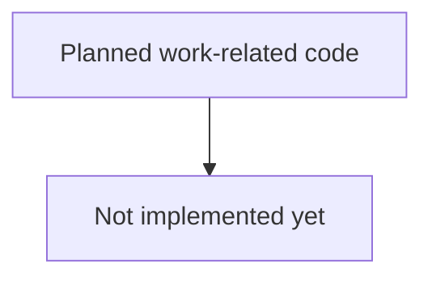

# internal/crawler/work.go

## 1. Overview
- Purpose: Provide a simple utility (`WorkTracker`) to track in-flight work items in the crawler.
- Problem it solves: Centralizes accounting for how many crawl items are currently being processed so the crawler can know when to shut down.
- High-level responsibility: Wrap `sync.WaitGroup` with a small API that the crawler and workers use to signal work start and completion.

## 2. File Location
- Relative path (from repo root): `crawler/internal/crawler/work.go`

## 3. Key Components
- `type WorkTracker struct { wg sync.WaitGroup }`
  - Thin wrapper around `sync.WaitGroup`.
- `func (w *WorkTracker) Add(n int)`
  - Increments the internal counter by `n` when new work starts.
- `func (w *WorkTracker) Done()`
  - Decrements the counter when a unit of work finishes.
- `func (w *WorkTracker) Wait()`
  - Blocks until the counter returns to zero (i.e., all work is done).

## 4. Execution Flow
1. The crawler increments the tracker when seeding initial work (e.g., adding the first URL).
2. Downstream workers call `Add` when they enqueue additional work and `Done` when work completes.
3. A goroutine in `crawler.Run` calls `tracker.Wait()` and cancels the context once all work is done.

## 5. Data Flow
- **Inputs**
  - Logical work units signaled via calls to `Add` and `Done`.
- **Processing steps**
  - Internally delegates to `sync.WaitGroup`.
- **Outputs**
  - Blocks until all tracked work completes.
- **Dependencies**
  - `sync` from the standard library.

## 6. Mermaid Diagrams

```mermaid
flowchart TD
  A["Planned work-related code"] --> B["Not implemented yet"]
```

## 7. Error Handling & Edge Cases
- Misuse (e.g., calling `Done` more times than `Add`) would panic via the underlying `WaitGroup`.

## 8. Example Usage
```go
var tracker crawler.WorkTracker

tracker.Add(1)
go func() {
  defer tracker.Done()
  // do work
}()

tracker.Wait() // blocks until all work is done
```
