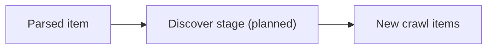

# internal/pipeline/discover.go

## 1. Overview
- Purpose: Intended to implement a "discover" stage in the pipeline that finds new crawl targets from existing data.
- Current state: The file exists but is empty.
- High-level responsibility (implied): Analyze parsed data or responses to discover additional URLs or items to enqueue.

## 2. File Location
- Relative path (from repo root): `crawler/internal/pipeline/discover.go`

## 3. Key Components
- No types, functions, or variables are currently defined.

## 4. Execution Flow
- No executable logic is present yet.
- Conceptually, this stage would:
  1. Receive processed items or parsed content.
  2. Extract new links or related resources.
  3. Emit new items back into the crawler's scheduling flow.

## 5. Data Flow
- **Inputs** (planned)
  - Parsed or processed items.
- **Processing steps** (planned)
  - Link or target discovery.
- **Outputs** (planned)
  - Newly discovered items for the scheduler.
- **Dependencies**
  - Will likely depend on shared item types and parsing results.

## 6. Mermaid Diagrams

## 7. Error Handling & Edge Cases
- None currently, as the file is empty.

## 8. Example Usage
- No examples yet; this stage will be wired into the pipeline once implemented.
