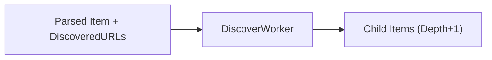

# internal/pipeline/discover.go

## 1. Overview
- Purpose: Schedule new crawl targets discovered by the parse stage.
- Current state: Implemented. `DiscoverWorker` reads parsed items and enqueues discovered internal links up to `maxDepth`.
- High-level responsibility: Turn `Item.DiscoveredURLs` into new `shared.Item` work units while keeping work accounting correct.

## 2. File Location
- Relative path (from repo root): `crawler/internal/pipeline/discover.go`

## 3. Key Components
- `func DiscoverWorker(ctx, in, out, maxDepth, tracker)`
  - For each parsed item:
    - If `item.Depth < maxDepth`, schedules `shared.Item{URL, Depth+1, Mode}` for each discovered URL.
    - Uses `tracker.Add(1)` *before* enqueueing each child, so the crawl can terminate correctly.
    - If the scheduler later drops the item as a duplicate (or due to max-pages cap), the scheduler compensates via `tracker.Done()`.
  - Always calls `tracker.Done()` for the current item after processing.

- `func orderDiscoveredURLs(urls []string) []string`
  - Reorders discovered URLs so likely “post” permalinks are enqueued before obvious listing pages (e.g., `/tag/`, `/category/`, `/author/`).

## 4. Execution Flow
1. Receive a parsed `shared.Item` from `in`.
2. If `item.Depth < maxDepth`:
  - Order `item.DiscoveredURLs` (post-like first).
  - For each discovered URL:
    - `tracker.Add(1)`
    - Send a child `shared.Item` to `out` with `Depth+1` and same `Mode`.
3. Mark the current item complete via `tracker.Done()`.

## 5. Data Flow
- **Inputs**
  - Parsed items (`shared.Item`) that may carry `DiscoveredURLs`.
- **Processing steps**
  - Depth check + ordering + enqueueing children.
- **Outputs**
  - New candidate items for the scheduler.
- **Dependencies**
  - Standard library: `net/url`, `strings`.
  - Internal: `crawler/internal/shared`.

## 6. Mermaid Diagrams

```mermaid
flowchart LR
  A["Parsed Item + DiscoveredURLs"] --> B["DiscoverWorker"]
  B --> C["Child Items (Depth+1)"]
```

## 7. Error Handling & Edge Cases
- Invalid discovered URLs are skipped.
- If `ctx` is canceled while enqueueing children, the worker undoes bookkeeping for the current item and the pending child.

## 8. Example Usage
Wired from `Crawler.Run`:

```go
go pipeline.DiscoverWorker(ctx, parsed, discovered, maxDepth, tracker)
go scheduler.Schedule(ctx, discovered, scheduled, tracker)
```
