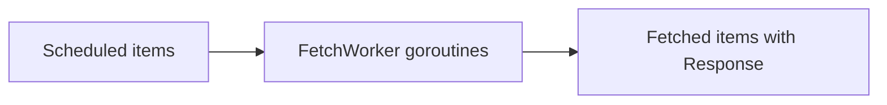

# internal/pipeline/fetch.go

## 1. Overview
- Purpose: Implement the "fetch" stage of the pipeline that performs HTTP requests for crawl items.
- Current state: The file contains a working HTTP client constructor and a `FetchWorker` function.
- High-level responsibility: Take scheduled `Item` values, issue HTTP requests with rate limiting, attach responses, and forward them downstream.

## 2. File Location
- Relative path (from repo root): `crawler/internal/pipeline/fetch.go`

## 3. Key Components
- `func NewHTTPClient(timeout time.Duration) *http.Client`
  - Constructs an `*http.Client` with the provided timeout.
-- `func FetchWorker(ctx context.Context, client *http.Client, limiter *DomainLimiter, in <-chan shared.Item, out chan<- shared.Item, mode shared.UseCase)`
  - Worker loop that:
    - Reads `crawler.Item` values from `in`.
    - Uses `limiter.Wait(item.URL.Host)` to enforce per-domain rate limiting.
    - Builds an HTTP GET request with `http.NewRequestWithContext`.
    - Executes the request with `client.Do(req)`.
    - On success, assigns the `*http.Response` to `item.Response`.
    - Logs a mode-specific message (e.g., `[Blogs]`, `[Health]`, `[SearchIndex]`) using the `mode` parameter so different use cases are visible in logs.
    - Attempts to send the enriched item to `out`, closing the response body and returning early if the context is canceled.

## 4. Execution Flow
1. The core crawler enqueues `crawler.Item` values onto a "scheduled" channel.
2. One or more `FetchWorker` goroutines read from that channel.
3. For each `Item`:
  - The worker waits on the domain limiter for `item.URL.Host`.
  - Builds a request bound to `ctx` and calls `client.Do(req)`.
  - On success, sets `item.Response = resp`.
4. The enriched `Item` is written to the "fetched" channel for downstream stages (parse, discover).
5. If `ctx` is canceled while sending, the worker closes `resp.Body` and returns.

## 5. Data Flow
-- **Inputs**
  - `shared.Item` values with populated `URL`, `Depth`, and `Mode` from the scheduled channel.
  - `ctx` for cancellation.
- **Processing steps**
  - Enforce domain-level rate limiting via `DomainLimiter`.
  - Perform HTTP GET requests using a shared `*http.Client`.
  - Attach the resulting `*http.Response` to each `Item`.
- **Outputs**
  - `crawler.Item` values with a populated `Response` field on the fetched channel.
- **Dependencies**
  - Standard library: `context`, `net/http`, `time`.
  - Internal: `crawler/internal/crawler` for `Item`, `DomainLimiter` from `internal/pipeline/limiter.go`.

## 6. Mermaid Diagrams


## 7. Error Handling & Edge Cases
- If `http.NewRequestWithContext` fails, the worker skips the item and continues.
- If `client.Do(req)` fails, the worker skips the item and continues.
- When the context is canceled while sending to `out`, the worker closes `resp.Body` to avoid leaks and returns.
- Callers downstream are responsible for closing `item.Response.Body` after they finish processing.

## 8. Example Usage
```go
client := pipeline.NewHTTPClient(10 * time.Second)
limiter := pipeline.NewDomainLimiter(500 * time.Millisecond)

scheduled := make(chan crawler.Item)
fetched := make(chan crawler.Item)

go pipeline.FetchWorker(ctx, client, limiter, scheduled, fetched)
```
