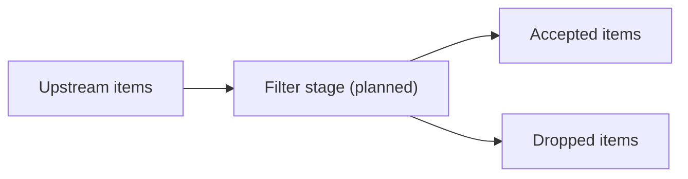

# internal/pipeline/filter.go

## 1. Overview
- Purpose: Intended to implement a "filter" stage in the pipeline that can drop or modify items based on rules.
- Current state: The Go file `internal/pipeline/filter.go` exists but is empty; this document describes the planned role.
- High-level responsibility (implied): Apply filtering logic (e.g., domain allowlists/denylists, content-based rules) before items proceed further down the pipeline.

## 2. File Location
- Relative path (from repo root): `crawler/internal/pipeline/filter.go`

## 3. Key Components (Planned)
- Functions or workers that:
  - Read `crawler.Item` values from an input channel.
  - Decide whether to keep, drop, or transform items based on configurable criteria.
  - Forward accepted items to the next stage.

## 4. Execution Flow (Planned)
1. Upstream stages (e.g., fetch or parse) write `crawler.Item` values to a "filter" channel.
2. Filter workers read from that channel.
3. Each worker applies filtering rules to decide whether to forward or discard an item.
4. Accepted items are sent to the next stage (e.g., parse, discover, or store).

## 5. Data Flow (Planned)
- **Inputs**
  - `crawler.Item` values from upstream stages.
- **Processing steps**
  - Evaluate items against rules (URL patterns, depth, content type, etc.).
- **Outputs**
  - Subset of items that pass the filters.
- **Dependencies**
  - Likely to depend on shared configuration and item definitions.

## 6. Mermaid Diagrams (Conceptual)

## 7. Error Handling & Edge Cases (Planned)
- Filtering logic should be deterministic and avoid panics on unexpected input.
- Misconfiguration (e.g., overly strict filters) could result in all items being dropped.

## 8. Example Usage
- No concrete API exists yet; once implemented, this stage will be wired into the pipeline by the core crawler.
