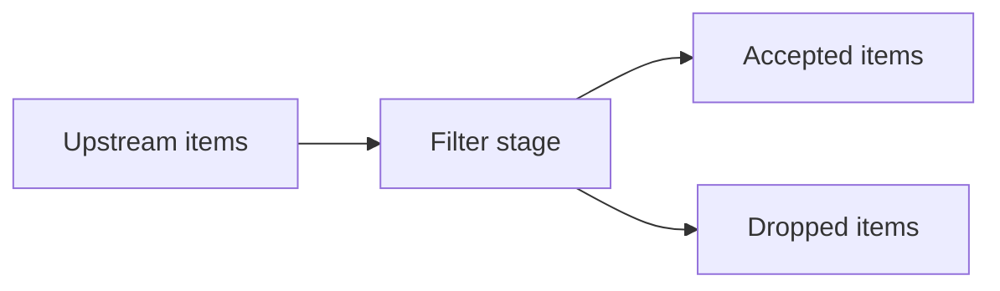

# internal/pipeline/filter.go

## 1. Overview
- Purpose: Provide a filter stage abstraction and a default implementation.
- Current state: Implements `AllowAllFilter`, which allows every item through.
- High-level responsibility: Decide whether an item is allowed to proceed (useful for later adding allow/deny rules).

## 2. File Location
- Relative path (from repo root): `crawler/internal/pipeline/filter.go`

## 3. Key Components
- `type AllowAllFilter struct{}`
  - Implements `Allow(item shared.Item) bool` and always returns `true`.

## 4. Execution Flow
This project does not currently wire a dedicated filter worker into the main crawl loop.
Conceptually, a filter would sit between scheduling/fetching and parsing/discovery.

## 5. Data Flow
- **Inputs**
  - `shared.Item` values from upstream stages.
- **Processing steps**
  - Evaluate items against rules (URL patterns, depth, content type, etc.).
- **Outputs**
  - Subset of items that pass the filters.
- **Dependencies**
  - Likely to depend on shared configuration and item definitions.

## 6. Mermaid Diagrams (Conceptual)


## 7. Error Handling & Edge Cases
- Filtering logic should be deterministic and avoid panics on unexpected input.
- Misconfiguration (e.g., overly strict filters) could result in all items being dropped.

## 8. Example Usage
```go
var f pipeline.AllowAllFilter
if f.Allow(item) {
  // keep item
}
```
