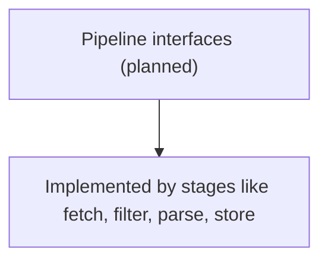

# internal/pipeline/interfaces.go

## 1. Overview
- Purpose: Intended to define shared interfaces for pipeline stages.
- Current state: The file exists but is empty.
- High-level responsibility (implied): Provide contracts that fetch, filter, parse, store, discover, and limiter components can implement.

## 2. File Location
- Relative path (from repo root): `crawler/internal/pipeline/interfaces.go`

## 3. Key Components
- No interfaces, types, or functions are currently defined.

## 4. Execution Flow
- This file is expected to declare types rather than contain control flow.

## 5. Data Flow
- **Inputs**: N/A for now; this will be type-level definitions.
- **Processing steps**: N/A.
- **Outputs**: Interfaces used across the `pipeline` package.
- **Dependencies**: None currently.

## 6. Mermaid Diagrams

## 7. Error Handling & Edge Cases
- None at present.

## 8. Example Usage
- No concrete examples yet; once interfaces are defined, other files in `internal/pipeline` will reference them.
