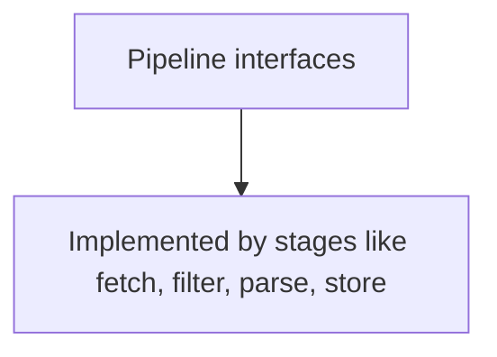

# internal/pipeline/interfaces.go

## 1. Overview
- Purpose: Define small interfaces for pluggable pipeline components.
- Current state: Implemented and used as a conceptual contract layer.
- High-level responsibility: Provide contracts that fetch, filter, parse, and store components can implement.

## 2. File Location
- Relative path (from repo root): `crawler/internal/pipeline/interfaces.go`

## 3. Key Components
- `type Fetcher`
  - `Fetch(ctx, item) (shared.Item, error)`
- `type Parser`
  - `Parse(ctx, item) ([]shared.Item, error)`
- `type Filter`
  - `Allow(item) bool`
- `type Store`
  - `Store(ctx, item) error`

## 4. Execution Flow
- This file is expected to declare types rather than contain control flow.

## 5. Data Flow
- **Inputs**: Type definitions only.
- **Processing steps**: N/A.
- **Outputs**: Interfaces used across the `pipeline` package.
- **Dependencies**: `context` and `crawler/internal/shared`.

## 6. Mermaid Diagrams

```mermaid
flowchart TD
  A["Pipeline interfaces"] --> B["Implemented by stages like fetch, filter, parse, store"]
```

## 7. Error Handling & Edge Cases
- None at present.

## 8. Example Usage
Implementations in this project include:

- `AllowAllFilter` in `filter.go` implementing `Filter`.
- `LogStore` in `store.go` implementing `Store`.
