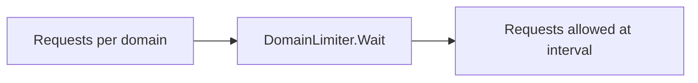

# internal/pipeline/limiter.go

## 1. Overview
- Purpose: Implement per-domain rate limiting for HTTP requests in the pipeline.
- Current state: Implemented. The file defines a `DomainLimiter` with a `Wait(domain)` method.
- High-level responsibility: Control how frequently requests are sent to each domain, preventing overload.

## 2. File Location
- Relative path (from repo root): `crawler/internal/pipeline/limiter.go`

## 3. Key Components
- `type DomainLimiter struct { mu sync.Mutex; interval time.Duration; lastScheduled map[string]time.Time; calls int }`
  - Holds a lock, a base interval, and a map from domain to the last scheduled request time.
  - Uses *reservation* instead of spawning `time.Ticker` goroutines: each `Wait()` call reserves the next available per-domain slot.
- `func NewDomainLimiter(interval time.Duration) *DomainLimiter`
  - Constructor that initializes the limiter with a given interval and an empty schedule map.
- `func (d *DomainLimiter) Wait(domain string)`
  - Ensures calls for a given domain are spaced at least `interval` apart.
  - First request for a domain has no delay; concurrent requests serialize naturally via scheduled times.
  - Periodically cleans up very old domains to avoid unbounded growth.

## 4. Execution Flow
1. Call `NewDomainLimiter(interval)` to create a limiter.
2. For each request, call `limiter.Wait(item.URL.Host)` before issuing the HTTP request.
3. `Wait` computes the next allowed time for that domain and stores it (reserving the slot).
4. If the reserved time is in the future, `Wait` sleeps until it.
5. The caller proceeds to perform the request.

## 5. Data Flow
- **Inputs**
  - Domain strings (e.g., `item.URL.Host`) passed to `Wait`.
- **Processing steps**
  - Lookup and reserve the next scheduled time per domain.
  - Sleep until scheduled time (if needed).
- **Outputs**
  - Callers are unblocked at a controlled rate and can proceed with their work.
- **Dependencies**
  - Standard library: `sync`, `time`.

## 6. Mermaid Diagrams


## 7. Error Handling & Edge Cases
- `Wait` is a no-op if:
  - The limiter pointer is `nil`.
  - `interval <= 0`.
  - `domain == ""`.

## 8. Example Usage
Used from the fetch stage:

```go
limiter := pipeline.NewDomainLimiter(500 * time.Millisecond)
limiter.Wait(item.URL.Host)
resp, err := client.Do(req)
```
