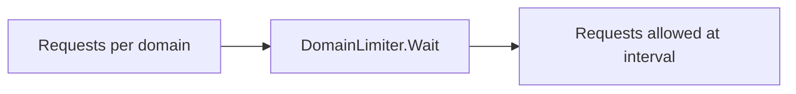

# internal/pipeline/limiter.go

## 1. Overview
- Purpose: Implement per-domain rate limiting for HTTP requests in the pipeline.
- Current state: The file defines a `DomainLimiter` type and a constructor.
- High-level responsibility: Control how frequently requests are sent to each domain, preventing overload.

## 2. File Location
- Relative path (from repo root): `crawler/internal/pipeline/limiter.go`

## 3. Key Components
- `type DomainLimiter struct { mu sync.Mutex; interval time.Duration; limiters map[string]*time.Ticker }`
  - Holds a lock, a base interval, and a map from domain to ticker.
- `func NewDomainLimiter(interval time.Duration) *DomainLimiter`
  - Constructor that initializes the limiter with a given interval and an empty ticker map.
- `func (d *DomainLimiter) Wait(domain string)`
  - Ensures that calls for a given domain are spaced at least `interval` apart by using a `time.Ticker`.

## 4. Execution Flow
1. Call `NewDomainLimiter(interval)` to create a limiter.
2. For each request, call `limiter.Wait(item.URL.Host)` before issuing the HTTP request.
3. `Wait` looks up or creates a `time.Ticker` for the domain and then blocks on `<-t.C`.
4. The caller proceeds to perform the request once the ticker fires.

## 5. Data Flow
- **Inputs**
  - Domain strings (e.g., `item.URL.Host`) passed to `Wait`.
- **Processing steps**
  - Lookup or create a ticker per domain.
  - Block until the ticker channel emits, enforcing spacing between calls.
- **Outputs**
  - Callers are unblocked at a controlled rate and can proceed with their work.
- **Dependencies**
  - Standard library: `sync`, `time`.

## 6. Mermaid Diagrams

## 7. Error Handling & Edge Cases
- None currently.

## 8. Example Usage
- No examples yet; this limiter will be integrated into the pipeline once implemented.
