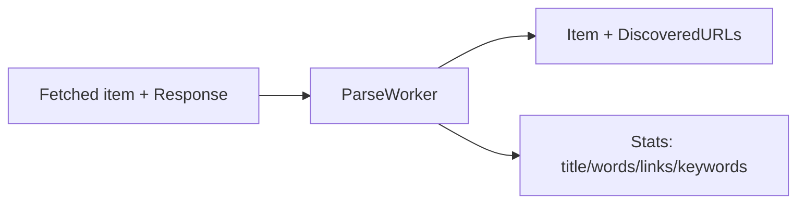

````markdown
# internal/pipeline/parse.go

## 1. Overview
- Purpose: Parse HTML responses into lightweight analytics (title, word count, link counts, keywords/topics) and extract internal links for discovery.
- Current state: Implemented. The `ParseWorker` performs best-effort DOM parsing and populates `Item.DiscoveredURLs` for the discover stage.
- High-level responsibility:
  - Be polite and safe: only parse HTML-like responses and read a bounded amount of bytes.
  - Derive useful page metrics for the stats collector.
  - Feed conservative internal links back into the crawl loop.

## 2. File Location
- Relative path (from repo root): `crawler/internal/pipeline/parse.go`

## 3. Key Components
- `func ParseWorker(ctx, in, out, stats)`
  - Reads `shared.Item` values with `Response` set by fetch.
  - Skips non-HTML responses based on `Content-Type`.
  - Reads a bounded amount of HTML bytes per page (currently 4 MiB cap).
  - Calls `extractPageMetrics(url, body)` to compute:
    - `title`
    - `wordCount`
    - `internalLinks`, `externalLinks`
    - `keywords`
    - `discovered` internal URLs
  - Populates `item.DiscoveredURLs = discovered`.
  - Records page metrics + topics into `stats` if present.

- `func extractPageMetrics(pageURL, body)`
  - Parses the HTML DOM (`golang.org/x/net/html`).
  - Extracts `<title>` from the full document.
  - Prefers visible text from `<main>` (then `<article>`, then whole doc) while skipping non-content regions (`nav`, `header`, `footer`, `aside`, scripts/styles).
  - Extracts and counts internal/external links.
  - Builds a conservative list of discovered internal URLs (see below).
  - Falls back to a regex-based extractor if DOM parsing fails.

## 4. Discovery Rules (in parse)
Discovery is conservative (it aims to find real content pages, not internal UI routes):

- Only same-host links are considered.
- Most query-string links are rejected (tracking-only queries may be normalized away).
- Common non-content areas are avoided (`/tag/`, `/category/`, `/author/`, `/wp-json/`, `/wp-admin/`, feeds, login/subscribe) except safe pagination.
- Common binary/asset extensions are excluded.
- “Post-like” paths are preferred (slug-like or date-based permalinks).
- On listing pages (multiple `<article>` elements), the parser prefers a single best permalink per `<article>` card and suppresses other `<article>`-internal links from discovery to reduce noise.

## 5. Data Flow
- **Input:** `shared.Item` with `Response`.
- **Output:** `shared.Item` with `Response` cleared (body closed) and `DiscoveredURLs` populated.
- **Side effects:** updates to `shared.CrawlStats`.

## 6. Mermaid Diagram


## 7. Error Handling & Edge Cases
- Non-HTML responses are skipped (body closed, item forwarded).
- HTML reads are bounded to avoid memory spikes.
- DOM parsing failures fall back to a conservative regex approach.

## 8. Example Usage
The core crawler wires the stage like:

```go
go pipeline.ParseWorker(ctx, fetched, parsed, stats)
```

````
