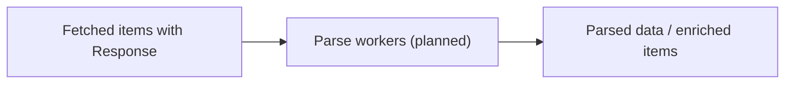

# internal/pipeline/parse.go

## 1. Overview
- Purpose: Intended to implement the "parse" stage of the pipeline that interprets HTTP responses.
- Current state: The file exists in `internal/pipeline` but is empty; this document describes the planned role.
- High-level responsibility (implied): Consume fetched `Item` values, parse their responses, and extract structured data.

## 2. File Location
- Relative path (from repo root): `crawler/internal/pipeline/parse.go`

## 3. Key Components (Planned)
- Worker functions that:
  - Read fetched `Item` values from an input channel.
  - Parse response bodies (e.g., HTML, JSON) into higher-level representations.
  - Attach parsing results to the `Item` or emit new domain-specific types.
  - Forward results to discovery or storage stages.

## 4. Execution Flow (Planned)
1. Fetch workers write `Item` values with populated `Response` fields to a "fetched" channel.
2. Parse workers read from that channel.
3. Each worker parses the response body and derives relevant information.
4. Parsed results are sent to downstream stages (e.g., discover, store).

## 5. Data Flow (Planned)
- **Inputs**
  - `Item` values with HTTP responses.
- **Processing steps**
  - Decode, parse, and transform the response content.
- **Outputs**
  - Parsed representations suitable for link discovery and/or storage.
- **Dependencies**
  - Parsing libraries appropriate to the content type (e.g., HTML or JSON parsers).

## 6. Mermaid Diagrams (Conceptual)

## 7. Error Handling & Edge Cases (Planned)
- Malformed content and unexpected content types should be handled without crashing workers.
- Large responses may require streaming or size limits.

## 8. Example Usage
- No concrete API exists yet; once implemented, this stage will be wired by `internal/crawler/crawler.go`.
