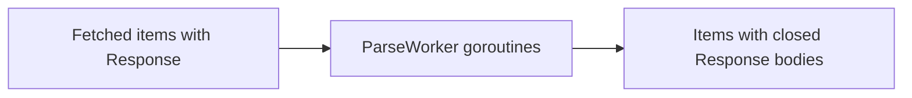

# internal/pipeline/parse.go

## 1. Overview
- Purpose: Implement a simple "parse" stage of the pipeline that currently just closes HTTP response bodies and forwards items downstream.
- Current state: The file defines a `ParseWorker` that acts as a pass-through cleanup stage.
- High-level responsibility: Ensure `item.Response.Body` is closed (if present) and propagate items to the next stage.

## 2. File Location
- Relative path (from repo root): `crawler/internal/pipeline/parse.go`

## 3. Key Components
- `func ParseWorker(ctx context.Context, in <-chan crawler.Item, out chan<- crawler.Item)`
  - Worker loop that:
    - Reads `crawler.Item` values from `in`.
    - If `item.Response` is non-nil, closes `item.Response.Body` to free resources.
    - Forwards the item to `out`, or returns early if `ctx` is canceled.

## 4. Execution Flow
1. Fetch workers write `crawler.Item` values with populated `Response` fields to a "fetched" channel.
2. One or more `ParseWorker` goroutines read from that channel.
3. For each `Item`, the worker closes `item.Response.Body` if `item.Response` is not nil.
4. The item is forwarded to the next stage via `out` (e.g., discovery).
5. If `ctx` is canceled or `in` is closed, the worker returns.

## 5. Data Flow
- **Inputs**
  - `crawler.Item` values with (optional) HTTP responses from the fetched channel.
- **Processing steps**
  - Close response bodies to avoid leaks.
  - (Future) Perform actual parsing of content if needed.
- **Outputs**
  - `crawler.Item` values forwarded to the downstream channel.
- **Dependencies**
  - Standard library: `context`.
  - Internal: `crawler/internal/crawler` for `Item`.

## 6. Mermaid Diagrams


## 7. Error Handling & Edge Cases
- If `in` is closed, the worker returns after draining remaining buffered items.
- If `ctx` is canceled, the worker returns promptly.
- Closing `item.Response.Body` is guarded by a nil check to avoid panics.

## 8. Example Usage
```go
parsed := make(chan crawler.Item)

go pipeline.ParseWorker(ctx, fetched, parsed)
```
