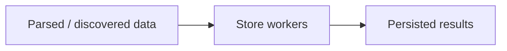

# internal/pipeline/store.go

## 1. Overview
- Purpose: Provide a simple "store" abstraction and a minimal implementation.
- Current state: Implements `LogStore`, which logs that an item was stored.
- High-level responsibility: Demonstrate where persistence would go (file, DB, queue, etc.).

## 2. File Location
- Relative path (from repo root): `crawler/internal/pipeline/store.go`

## 3. Key Components
- `type LogStore struct{}`
  - Implements `Store(ctx, item) error` and logs `item.URL`.

## 4. Execution Flow
This project does not currently wire a dedicated store worker into the core crawl loop.
The HTTP service persists *crawl summaries* via `internal/store` (JSONL history).

## 5. Data Flow
- **Inputs**
  - `shared.Item` values or parsed results (depending on your design).
- **Processing steps**
  - Transform results into a storable format.
  - Write to the configured backend.
- **Outputs**
  - Side-effectful persistence operations.
- **Dependencies**
  - Storage clients (e.g., filesystem, SQL/NoSQL drivers, or message queue SDKs).

## 6. Mermaid Diagrams (Conceptual)


## 7. Error Handling & Edge Cases
- Storage failures should be retried or surfaced without crashing the entire crawler.
- Backpressure from slow storage backends may need to propagate upstream.

## 8. Example Usage
```go
var s pipeline.LogStore
_ = s.Store(ctx, item)
```
