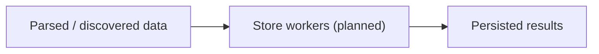

# internal/pipeline/store.go

## 1. Overview
- Purpose: Intended to implement the "store" stage of the pipeline that persists crawl results.
- Current state: The file exists in `internal/pipeline` but is empty; this document describes the planned role.
- High-level responsibility (implied): Take parsed data or enriched items and write them to a storage backend.

## 2. File Location
- Relative path (from repo root): `crawler/internal/pipeline/store.go`

## 3. Key Components (Planned)
- Functions or workers that:
  - Read parsed items or domain objects from an input channel.
  - Serialize and persist them (e.g., to files, databases, or message queues).
  - Optionally handle batching and backpressure from the storage layer.

## 4. Execution Flow (Planned)
1. Upstream stages (parse, discover) emit results to a "store" channel.
2. Store workers read from that channel.
3. Each worker persists the data and optionally reports metrics.

## 5. Data Flow (Planned)
- **Inputs**
  - Parsed or enriched crawl results.
- **Processing steps**
  - Transform results into a storable format.
  - Write to the configured backend.
- **Outputs**
  - Side-effectful persistence operations.
- **Dependencies**
  - Storage clients (e.g., filesystem, SQL/NoSQL drivers, or message queue SDKs).

## 6. Mermaid Diagrams (Conceptual)

## 7. Error Handling & Edge Cases (Planned)
- Storage failures should be retried or surfaced without crashing the entire crawler.
- Backpressure from slow storage backends may need to propagate upstream.

## 8. Example Usage
- No concrete API exists yet; once implemented, this stage will be invoked from the core crawler's pipeline wiring.
